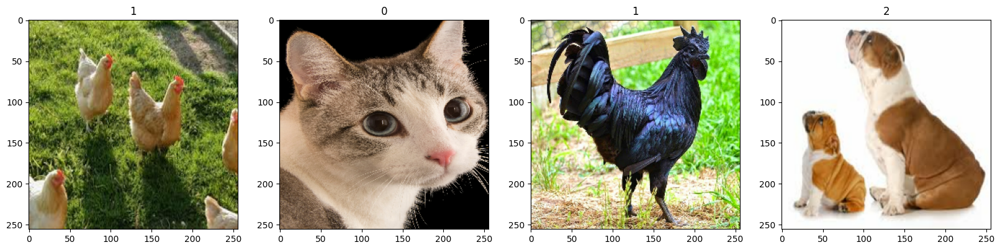
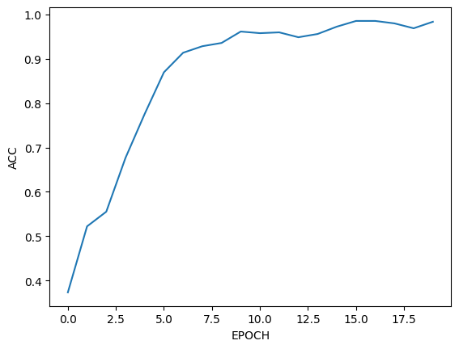
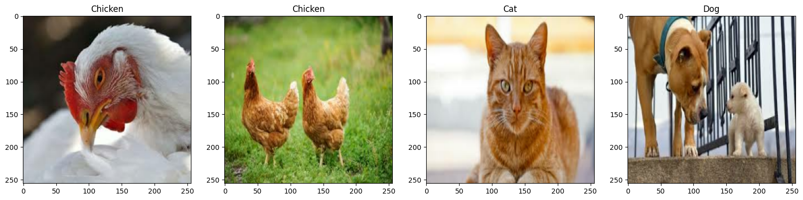

# This is a small CNN model to classify animals (Dogs, Cats and Chickens)


## Imports


```python
import tensorflow as tf
import numpy as np
from matplotlib import pyplot as plt
import cv2
import imghdr
import os
```

    /Users/ahmed/Library/Python/3.9/lib/python/site-packages/urllib3/__init__.py:35: NotOpenSSLWarning: urllib3 v2 only supports OpenSSL 1.1.1+, currently the 'ssl' module is compiled with 'LibreSSL 2.8.3'. See: https://github.com/urllib3/urllib3/issues/3020
      warnings.warn(


## Validate Images


```python
data_dir = "data"
image_exts = ['jpg', 'jpeg', 'JPG', 'JPEG', 'bmp', 'png', 'PNG']
image_class_count = 0
for image_class in os.listdir(data_dir):
    if image_class.startswith('.'):
        continue
    image_class_count += 1
    for image in os.listdir(os.path.join(data_dir, image_class)):
        if image_class.startswith('.'):
            continue
        image_path = os.path.join(data_dir, image_class, image)
        try:
            img = cv2.imread(image_path)
            ext = imghdr.what(image_path)
            if ext not in image_exts:
                print('Image {} extension not supported {}', format(image_path), ext)
                os.remove(image_path)
        except Exception as e:
            print("Error loading {}", format(image_path))
```

    Image {} extension not supported {} data/cat/black-cat-back.jpg None
    Image {} extension not supported {} data/cat/pallas-cat-1-250-384.webp webp
    Image {} extension not supported {} data/cat/two-different-breeds-of-cats-side-by-side-outdoors-in-the-garden.jpg None
    Image {} extension not supported {} data/cat/Orange-colored-cat-yawns-displaying-teeth.jpg None
    Image {} extension not supported {} data/cat/vector.svg None
    Image {} extension not supported {} data/cat/vector9.svg None
    Image {} extension not supported {} data/cat/vector8.svg None
    Image {} extension not supported {} data/cat/800px-Juvenile_Ragdoll.jpg None
    Image {} extension not supported {} data/cat/studio-portrait-sitting-tabby-cat-600nw-2269389471.jpg None
    Image {} extension not supported {} data/cat/1200px-Cat_November_2010-1a.jpg None
    Image {} extension not supported {} data/cat/vector3.svg None
    Image {} extension not supported {} data/cat/Kitten.jpg.webp webp
    Image {} extension not supported {} data/cat/vector2.svg None
    Image {} extension not supported {} data/cat/vector6.svg None
    Image {} extension not supported {} data/cat/vector7.svg None
    Image {} extension not supported {} data/cat/vector5.svg None
    Image {} extension not supported {} data/cat/vector4.svg None
    Image {} extension not supported {} data/cat/629a868d4bf2b530bba4e756_Dimensions-Animals-Cats-Intro-Group-2.svg None
    Image {} extension not supported {} data/cat/Scottish-fold-cat.jpg None
    Image {} extension not supported {} data/cat/unnamed-4.jpg None
    Image {} extension not supported {} data/cat/vector10.svg None
    Image {} extension not supported {} data/cat/vector11.svg None
    Image {} extension not supported {} data/cat/Portrait-of-a-cat-with-whiskers-visible.jpg None
    Image {} extension not supported {} data/dog/shutterstock_56508520-1.jpg None
    Image {} extension not supported {} data/dog/vector.svg None
    Image {} extension not supported {} data/dog/0e2bca7f082d4e959f38113d2129b841.jpg None
    Image {} extension not supported {} data/dog/vector9.svg None
    Image {} extension not supported {} data/dog/vector8.svg None
    Image {} extension not supported {} data/dog/GoldenRetrieversdanspetcare.jpeg None
    Image {} extension not supported {} data/dog/GettyImages-764782285-e1688762016649.jpg webp
    Image {} extension not supported {} data/dog/a-small-puppy-for-a-walk-two-golden-retriever-dogs-on-the-road-in-2252922629.jpg None
    Image {} extension not supported {} data/dog/purebred-adult-dog-outdoors-nature-260nw-582849898.jpg None
    Image {} extension not supported {} data/dog/vector3.svg None
    Image {} extension not supported {} data/dog/vector2.svg None
    Image {} extension not supported {} data/dog/vector6.svg None
    Image {} extension not supported {} data/dog/vector7.svg None
    Image {} extension not supported {} data/dog/When-Do-Dogs-Stop-Growing-LS-long.jpg None
    Image {} extension not supported {} data/dog/7db1503d8f6e4e3db43eb14ee92a8066.jpg None
    Image {} extension not supported {} data/dog/vector5.svg None
    Image {} extension not supported {} data/dog/Adult-dog-exercising-outdoors_resized.jpg None
    Image {} extension not supported {} data/dog/vector4.svg None


    libpng warning: iCCP: known incorrect sRGB profile


    Image {} extension not supported {} data/dog/The_Wildest_Editorial_Adopting-Adult-Rescue-Dog_AdobeStock_303804010.jpg None


    libpng warning: iCCP: known incorrect sRGB profile


    Image {} extension not supported {} data/chicken/800px-Pollito.jpg None
    Image {} extension not supported {} data/chicken/rooster-Rhode-Island-Red-roosters-chicken-domestication.jpg None
    Image {} extension not supported {} data/chicken/.DS_Store None
    Image {} extension not supported {} data/chicken/chicken2.jpg None
    Image {} extension not supported {} data/chicken/clustering-chickens-henhouse-England-Devon-Members-flocks.jpg None
    Image {} extension not supported {} data/chicken/img-730x400-community-content-vet-33-627239.jpg None
    Image {} extension not supported {} data/chicken/Chicken.jpg None
    Image {} extension not supported {} data/chicken/chicken-sunset-600nw-752120836.jpg None
    Image {} extension not supported {} data/chicken/chickens-in-grass_0.jpg None
    Image {} extension not supported {} data/chicken/1462061.webp webp
    Image {} extension not supported {} data/chicken/colonel-by-erin-1.jpg None


    libpng warning: iCCP: known incorrect sRGB profile


## Loading Data


```python
data = tf.keras.utils.image_dataset_from_directory(data_dir)
data_itr = data.as_numpy_iterator()
batch = data_itr.next()
```

    Found 781 files belonging to 3 classes.


    2024-05-30 21:06:50.934017: I metal_plugin/src/device/metal_device.cc:1154] Metal device set to: Apple M1
    2024-05-30 21:06:50.934044: I metal_plugin/src/device/metal_device.cc:296] systemMemory: 8.00 GB
    2024-05-30 21:06:50.934049: I metal_plugin/src/device/metal_device.cc:313] maxCacheSize: 2.67 GB
    2024-05-30 21:06:50.934072: I tensorflow/core/common_runtime/pluggable_device/pluggable_device_factory.cc:305] Could not identify NUMA node of platform GPU ID 0, defaulting to 0. Your kernel may not have been built with NUMA support.
    2024-05-30 21:06:50.934090: I tensorflow/core/common_runtime/pluggable_device/pluggable_device_factory.cc:271] Created TensorFlow device (/job:localhost/replica:0/task:0/device:GPU:0 with 0 MB memory) -> physical PluggableDevice (device: 0, name: METAL, pci bus id: <undefined>)
    2024-05-30 21:06:51.215918: W tensorflow/core/lib/png/png_io.cc:89] PNG warning: iCCP: known incorrect sRGB profile


```python
fig, ax = plt.subplots(ncols=4, figsize=(20,20))
for idx, img in enumerate(batch[0][:4]):
    ax[idx].imshow(img.astype(int))
    ax[idx].title.set_text(batch[1][idx])
```


    

    


```python
# data = data.map(lambda x,y: (x/255, y))
# data_itr = data.as_numpy_iterator()
batch = data_itr.next()
batch[0][0].shape
```


    (256, 256, 3)


# Splitting Data


```python
data_len = len(data)
train_len = int(data_len * 0.7)
val_len = int(data_len * 0.2)
test_len = int(data_len * 0.1) + 1
if train_len + val_len + test_len - data_len != 0:
    print("Train: ", train_len, " Val: ", val_len, " Test: ", test_len, " Total: ", data_len, " Missing: ", train_len + val_len + test_len - data_len)
    print("Please check padding")
```


```python
train_data = data.take(train_len)
val_data = data.skip(train_len).take(val_len)
test_data = data.skip(train_len+val_len).take(test_len)
```


```python
train_data
```


    <_TakeDataset element_spec=(TensorSpec(shape=(None, 256, 256, 3), dtype=tf.float32, name=None), TensorSpec(shape=(None,), dtype=tf.int32, name=None))>


## Building Model


```python
model = tf.keras.Sequential([
    tf.keras.layers.Conv2D(16, (3, 3), activation="relu", input_shape=(256, 256, 3)),
    tf.keras.layers.MaxPooling2D(2, 2),
    tf.keras.layers.Conv2D(32, (3, 3), activation="relu"),
    tf.keras.layers.MaxPooling2D(2, 2),
    tf.keras.layers.Conv2D(16, (3, 3), activation="relu"),
    tf.keras.layers.MaxPooling2D(2, 2),

    tf.keras.layers.Flatten(),
    tf.keras.layers.Dropout(0.5),
    tf.keras.layers.Dense(256, activation="relu"),
    tf.keras.layers.Dense(image_class_count),
])

model.compile(optimizer="adam", loss=tf.keras.losses.SparseCategoricalCrossentropy(from_logits=True), metrics=["accuracy"])
model.summary()
```


<pre style="white-space:pre;overflow-x:auto;line-height:normal;font-family:Menlo,'DejaVu Sans Mono',consolas,'Courier New',monospace"><span style="font-weight: bold">Model: "sequential_5"</span>
</pre>


<pre style="white-space:pre;overflow-x:auto;line-height:normal;font-family:Menlo,'DejaVu Sans Mono',consolas,'Courier New',monospace">┏━━━━━━━━━━━━━━━━━━━━━━━━━━━━━━━━━┳━━━━━━━━━━━━━━━━━━━━━━━━┳━━━━━━━━━━━━━━━┓
┃<span style="font-weight: bold"> Layer (type)                    </span>┃<span style="font-weight: bold"> Output Shape           </span>┃<span style="font-weight: bold">       Param # </span>┃
┡━━━━━━━━━━━━━━━━━━━━━━━━━━━━━━━━━╇━━━━━━━━━━━━━━━━━━━━━━━━╇━━━━━━━━━━━━━━━┩
│ conv2d_15 (<span style="color: #0087ff; text-decoration-color: #0087ff">Conv2D</span>)              │ (<span style="color: #00d7ff; text-decoration-color: #00d7ff">None</span>, <span style="color: #00af00; text-decoration-color: #00af00">254</span>, <span style="color: #00af00; text-decoration-color: #00af00">254</span>, <span style="color: #00af00; text-decoration-color: #00af00">16</span>)   │           <span style="color: #00af00; text-decoration-color: #00af00">448</span> │
├─────────────────────────────────┼────────────────────────┼───────────────┤
│ max_pooling2d_15 (<span style="color: #0087ff; text-decoration-color: #0087ff">MaxPooling2D</span>) │ (<span style="color: #00d7ff; text-decoration-color: #00d7ff">None</span>, <span style="color: #00af00; text-decoration-color: #00af00">127</span>, <span style="color: #00af00; text-decoration-color: #00af00">127</span>, <span style="color: #00af00; text-decoration-color: #00af00">16</span>)   │             <span style="color: #00af00; text-decoration-color: #00af00">0</span> │
├─────────────────────────────────┼────────────────────────┼───────────────┤
│ conv2d_16 (<span style="color: #0087ff; text-decoration-color: #0087ff">Conv2D</span>)              │ (<span style="color: #00d7ff; text-decoration-color: #00d7ff">None</span>, <span style="color: #00af00; text-decoration-color: #00af00">125</span>, <span style="color: #00af00; text-decoration-color: #00af00">125</span>, <span style="color: #00af00; text-decoration-color: #00af00">32</span>)   │         <span style="color: #00af00; text-decoration-color: #00af00">4,640</span> │
├─────────────────────────────────┼────────────────────────┼───────────────┤
│ max_pooling2d_16 (<span style="color: #0087ff; text-decoration-color: #0087ff">MaxPooling2D</span>) │ (<span style="color: #00d7ff; text-decoration-color: #00d7ff">None</span>, <span style="color: #00af00; text-decoration-color: #00af00">62</span>, <span style="color: #00af00; text-decoration-color: #00af00">62</span>, <span style="color: #00af00; text-decoration-color: #00af00">32</span>)     │             <span style="color: #00af00; text-decoration-color: #00af00">0</span> │
├─────────────────────────────────┼────────────────────────┼───────────────┤
│ conv2d_17 (<span style="color: #0087ff; text-decoration-color: #0087ff">Conv2D</span>)              │ (<span style="color: #00d7ff; text-decoration-color: #00d7ff">None</span>, <span style="color: #00af00; text-decoration-color: #00af00">60</span>, <span style="color: #00af00; text-decoration-color: #00af00">60</span>, <span style="color: #00af00; text-decoration-color: #00af00">16</span>)     │         <span style="color: #00af00; text-decoration-color: #00af00">4,624</span> │
├─────────────────────────────────┼────────────────────────┼───────────────┤
│ max_pooling2d_17 (<span style="color: #0087ff; text-decoration-color: #0087ff">MaxPooling2D</span>) │ (<span style="color: #00d7ff; text-decoration-color: #00d7ff">None</span>, <span style="color: #00af00; text-decoration-color: #00af00">30</span>, <span style="color: #00af00; text-decoration-color: #00af00">30</span>, <span style="color: #00af00; text-decoration-color: #00af00">16</span>)     │             <span style="color: #00af00; text-decoration-color: #00af00">0</span> │
├─────────────────────────────────┼────────────────────────┼───────────────┤
│ flatten_5 (<span style="color: #0087ff; text-decoration-color: #0087ff">Flatten</span>)             │ (<span style="color: #00d7ff; text-decoration-color: #00d7ff">None</span>, <span style="color: #00af00; text-decoration-color: #00af00">14400</span>)          │             <span style="color: #00af00; text-decoration-color: #00af00">0</span> │
├─────────────────────────────────┼────────────────────────┼───────────────┤
│ dropout_2 (<span style="color: #0087ff; text-decoration-color: #0087ff">Dropout</span>)             │ (<span style="color: #00d7ff; text-decoration-color: #00d7ff">None</span>, <span style="color: #00af00; text-decoration-color: #00af00">14400</span>)          │             <span style="color: #00af00; text-decoration-color: #00af00">0</span> │
├─────────────────────────────────┼────────────────────────┼───────────────┤
│ dense_10 (<span style="color: #0087ff; text-decoration-color: #0087ff">Dense</span>)                │ (<span style="color: #00d7ff; text-decoration-color: #00d7ff">None</span>, <span style="color: #00af00; text-decoration-color: #00af00">256</span>)            │     <span style="color: #00af00; text-decoration-color: #00af00">3,686,656</span> │
├─────────────────────────────────┼────────────────────────┼───────────────┤
│ dense_11 (<span style="color: #0087ff; text-decoration-color: #0087ff">Dense</span>)                │ (<span style="color: #00d7ff; text-decoration-color: #00d7ff">None</span>, <span style="color: #00af00; text-decoration-color: #00af00">3</span>)              │           <span style="color: #00af00; text-decoration-color: #00af00">771</span> │
└─────────────────────────────────┴────────────────────────┴───────────────┘
</pre>


<pre style="white-space:pre;overflow-x:auto;line-height:normal;font-family:Menlo,'DejaVu Sans Mono',consolas,'Courier New',monospace"><span style="font-weight: bold"> Total params: </span><span style="color: #00af00; text-decoration-color: #00af00">3,697,139</span> (14.10 MB)
</pre>


<pre style="white-space:pre;overflow-x:auto;line-height:normal;font-family:Menlo,'DejaVu Sans Mono',consolas,'Courier New',monospace"><span style="font-weight: bold"> Trainable params: </span><span style="color: #00af00; text-decoration-color: #00af00">3,697,139</span> (14.10 MB)
</pre>


<pre style="white-space:pre;overflow-x:auto;line-height:normal;font-family:Menlo,'DejaVu Sans Mono',consolas,'Courier New',monospace"><span style="font-weight: bold"> Non-trainable params: </span><span style="color: #00af00; text-decoration-color: #00af00">0</span> (0.00 B)
</pre>


## Training Model


```python
logs_dir="logs"
tensorboard_callback = tf.keras.callbacks.TensorBoard(log_dir=logs_dir)
```


```python
epochs = 20
hist = model.fit(train_data, validation_data=val_data, epochs=epochs, callbacks=[tensorboard_callback], verbose=0)
last_acc = hist.history["accuracy"][-1] * 100
print("Training Done, Accuracy: {0:.2f} %".format(last_acc))
```

    2024-05-30 21:24:32.880785: W tensorflow/core/lib/png/png_io.cc:89] PNG warning: iCCP: known incorrect sRGB profile
    2024-05-30 21:24:34.020762: W tensorflow/core/lib/png/png_io.cc:89] PNG warning: iCCP: known incorrect sRGB profile
    2024-05-30 21:24:34.142952: W tensorflow/core/lib/png/png_io.cc:89] PNG warning: iCCP: known incorrect sRGB profile
    2024-05-30 21:24:35.208579: W tensorflow/core/lib/png/png_io.cc:89] PNG warning: iCCP: known incorrect sRGB profile
    2024-05-30 21:24:35.323857: W tensorflow/core/lib/png/png_io.cc:89] PNG warning: iCCP: known incorrect sRGB profile
    2024-05-30 21:24:35.581286: W tensorflow/core/lib/png/png_io.cc:89] PNG warning: iCCP: known incorrect sRGB profile
    2024-05-30 21:24:36.287517: W tensorflow/core/lib/png/png_io.cc:89] PNG warning: iCCP: known incorrect sRGB profile
    2024-05-30 21:24:36.435625: W tensorflow/core/lib/png/png_io.cc:89] PNG warning: iCCP: known incorrect sRGB profile
    2024-05-30 21:24:36.436910: W tensorflow/core/lib/png/png_io.cc:89] PNG warning: iCCP: known incorrect sRGB profile
    2024-05-30 21:24:38.107451: W tensorflow/core/lib/png/png_io.cc:89] PNG warning: iCCP: known incorrect sRGB profile
    2024-05-30 21:24:38.251353: W tensorflow/core/lib/png/png_io.cc:89] PNG warning: iCCP: known incorrect sRGB profile
    2024-05-30 21:24:38.261120: W tensorflow/core/lib/png/png_io.cc:89] PNG warning: iCCP: known incorrect sRGB profile
    2024-05-30 21:24:39.087106: W tensorflow/core/lib/png/png_io.cc:89] PNG warning: iCCP: known incorrect sRGB profile
    2024-05-30 21:24:39.844366: W tensorflow/core/lib/png/png_io.cc:89] PNG warning: iCCP: known incorrect sRGB profile
    2024-05-30 21:24:39.950132: W tensorflow/core/lib/png/png_io.cc:89] PNG warning: iCCP: known incorrect sRGB profile
    2024-05-30 21:24:40.964409: W tensorflow/core/lib/png/png_io.cc:89] PNG warning: iCCP: known incorrect sRGB profile
    2024-05-30 21:24:41.123941: W tensorflow/core/lib/png/png_io.cc:89] PNG warning: iCCP: known incorrect sRGB profile
    2024-05-30 21:24:41.370080: W tensorflow/core/lib/png/png_io.cc:89] PNG warning: iCCP: known incorrect sRGB profile
    2024-05-30 21:24:41.793313: W tensorflow/core/lib/png/png_io.cc:89] PNG warning: iCCP: known incorrect sRGB profile
    2024-05-30 21:24:42.325219: W tensorflow/core/lib/png/png_io.cc:89] PNG warning: iCCP: known incorrect sRGB profile
    2024-05-30 21:24:43.708336: W tensorflow/core/lib/png/png_io.cc:89] PNG warning: iCCP: known incorrect sRGB profile
    2024-05-30 21:24:43.715744: W tensorflow/core/lib/png/png_io.cc:89] PNG warning: iCCP: known incorrect sRGB profile
    2024-05-30 21:24:43.847184: W tensorflow/core/lib/png/png_io.cc:89] PNG warning: iCCP: known incorrect sRGB profile
    2024-05-30 21:24:44.490518: W tensorflow/core/lib/png/png_io.cc:89] PNG warning: iCCP: known incorrect sRGB profile
    2024-05-30 21:24:45.067624: W tensorflow/core/lib/png/png_io.cc:89] PNG warning: iCCP: known incorrect sRGB profile
    2024-05-30 21:24:45.464087: W tensorflow/core/lib/png/png_io.cc:89] PNG warning: iCCP: known incorrect sRGB profile
    2024-05-30 21:24:46.549478: W tensorflow/core/lib/png/png_io.cc:89] PNG warning: iCCP: known incorrect sRGB profile
    2024-05-30 21:24:46.595771: W tensorflow/core/lib/png/png_io.cc:89] PNG warning: iCCP: known incorrect sRGB profile
    2024-05-30 21:24:46.770717: W tensorflow/core/lib/png/png_io.cc:89] PNG warning: iCCP: known incorrect sRGB profile
    2024-05-30 21:24:47.194339: W tensorflow/core/lib/png/png_io.cc:89] PNG warning: iCCP: known incorrect sRGB profile
    2024-05-30 21:24:48.773470: W tensorflow/core/lib/png/png_io.cc:89] PNG warning: iCCP: known incorrect sRGB profile
    2024-05-30 21:24:48.774766: W tensorflow/core/lib/png/png_io.cc:89] PNG warning: iCCP: known incorrect sRGB profile
    2024-05-30 21:24:49.169365: W tensorflow/core/lib/png/png_io.cc:89] PNG warning: iCCP: known incorrect sRGB profile
    2024-05-30 21:24:49.251702: W tensorflow/core/lib/png/png_io.cc:89] PNG warning: iCCP: known incorrect sRGB profile
    2024-05-30 21:24:49.488802: W tensorflow/core/lib/png/png_io.cc:89] PNG warning: iCCP: known incorrect sRGB profile
    2024-05-30 21:24:50.049893: W tensorflow/core/lib/png/png_io.cc:89] PNG warning: iCCP: known incorrect sRGB profile
    2024-05-30 21:24:50.216593: W tensorflow/core/lib/png/png_io.cc:89] PNG warning: iCCP: known incorrect sRGB profile
    2024-05-30 21:24:50.639487: W tensorflow/core/lib/png/png_io.cc:89] PNG warning: iCCP: known incorrect sRGB profile
    2024-05-30 21:24:52.319943: W tensorflow/core/lib/png/png_io.cc:89] PNG warning: iCCP: known incorrect sRGB profile
    2024-05-30 21:24:52.334403: W tensorflow/core/lib/png/png_io.cc:89] PNG warning: iCCP: known incorrect sRGB profile
    2024-05-30 21:24:52.378402: W tensorflow/core/lib/png/png_io.cc:89] PNG warning: iCCP: known incorrect sRGB profile
    2024-05-30 21:24:52.966695: W tensorflow/core/lib/png/png_io.cc:89] PNG warning: iCCP: known incorrect sRGB profile
    2024-05-30 21:24:53.166386: W tensorflow/core/lib/png/png_io.cc:89] PNG warning: iCCP: known incorrect sRGB profile
    2024-05-30 21:24:53.367257: W tensorflow/core/lib/png/png_io.cc:89] PNG warning: iCCP: known incorrect sRGB profile
    2024-05-30 21:24:54.916678: W tensorflow/core/lib/png/png_io.cc:89] PNG warning: iCCP: known incorrect sRGB profile
    2024-05-30 21:24:55.075007: W tensorflow/core/lib/png/png_io.cc:89] PNG warning: iCCP: known incorrect sRGB profile
    2024-05-30 21:24:55.174320: W tensorflow/core/lib/png/png_io.cc:89] PNG warning: iCCP: known incorrect sRGB profile
    2024-05-30 21:24:55.656962: W tensorflow/core/lib/png/png_io.cc:89] PNG warning: iCCP: known incorrect sRGB profile
    2024-05-30 21:24:55.697892: W tensorflow/core/lib/png/png_io.cc:89] PNG warning: iCCP: known incorrect sRGB profile
    2024-05-30 21:24:56.831250: W tensorflow/core/lib/png/png_io.cc:89] PNG warning: iCCP: known incorrect sRGB profile
    2024-05-30 21:24:57.499028: W tensorflow/core/lib/png/png_io.cc:89] PNG warning: iCCP: known incorrect sRGB profile
    2024-05-30 21:24:57.749338: W tensorflow/core/lib/png/png_io.cc:89] PNG warning: iCCP: known incorrect sRGB profile
    2024-05-30 21:24:57.849800: W tensorflow/core/lib/png/png_io.cc:89] PNG warning: iCCP: known incorrect sRGB profile
    2024-05-30 21:24:58.469475: W tensorflow/core/lib/png/png_io.cc:89] PNG warning: iCCP: known incorrect sRGB profile
    2024-05-30 21:24:58.820169: W tensorflow/core/lib/png/png_io.cc:89] PNG warning: iCCP: known incorrect sRGB profile
    2024-05-30 21:24:59.126729: W tensorflow/core/lib/png/png_io.cc:89] PNG warning: iCCP: known incorrect sRGB profile
    2024-05-30 21:25:00.441495: W tensorflow/core/lib/png/png_io.cc:89] PNG warning: iCCP: known incorrect sRGB profile
    2024-05-30 21:25:00.449828: W tensorflow/core/lib/png/png_io.cc:89] PNG warning: iCCP: known incorrect sRGB profile
    2024-05-30 21:25:00.487731: W tensorflow/core/lib/png/png_io.cc:89] PNG warning: iCCP: known incorrect sRGB profile
    2024-05-30 21:25:01.259497: W tensorflow/core/lib/png/png_io.cc:89] PNG warning: iCCP: known incorrect sRGB profile
    2024-05-30 21:25:01.343544: W tensorflow/core/lib/png/png_io.cc:89] PNG warning: iCCP: known incorrect sRGB profile
    2024-05-30 21:25:02.840398: W tensorflow/core/lib/png/png_io.cc:89] PNG warning: iCCP: known incorrect sRGB profile
    2024-05-30 21:25:03.380378: W tensorflow/core/lib/png/png_io.cc:89] PNG warning: iCCP: known incorrect sRGB profile
    2024-05-30 21:25:03.432762: W tensorflow/core/lib/png/png_io.cc:89] PNG warning: iCCP: known incorrect sRGB profile
    2024-05-30 21:25:03.553173: W tensorflow/core/lib/png/png_io.cc:89] PNG warning: iCCP: known incorrect sRGB profile
    2024-05-30 21:25:04.143611: W tensorflow/core/lib/png/png_io.cc:89] PNG warning: iCCP: known incorrect sRGB profile
    2024-05-30 21:25:04.223747: W tensorflow/core/lib/png/png_io.cc:89] PNG warning: iCCP: known incorrect sRGB profile
    2024-05-30 21:25:04.519005: W tensorflow/core/lib/png/png_io.cc:89] PNG warning: iCCP: known incorrect sRGB profile
    2024-05-30 21:25:06.347459: W tensorflow/core/lib/png/png_io.cc:89] PNG warning: iCCP: known incorrect sRGB profile
    2024-05-30 21:25:06.370548: W tensorflow/core/lib/png/png_io.cc:89] PNG warning: iCCP: known incorrect sRGB profile
    2024-05-30 21:25:06.487190: W tensorflow/core/lib/png/png_io.cc:89] PNG warning: iCCP: known incorrect sRGB profile
    2024-05-30 21:25:07.535969: W tensorflow/core/lib/png/png_io.cc:89] PNG warning: iCCP: known incorrect sRGB profile
    2024-05-30 21:25:07.537553: W tensorflow/core/lib/png/png_io.cc:89] PNG warning: iCCP: known incorrect sRGB profile
    2024-05-30 21:25:08.063143: W tensorflow/core/lib/png/png_io.cc:89] PNG warning: iCCP: known incorrect sRGB profile
    2024-05-30 21:25:08.843378: W tensorflow/core/lib/png/png_io.cc:89] PNG warning: iCCP: known incorrect sRGB profile
    2024-05-30 21:25:08.933647: W tensorflow/core/lib/png/png_io.cc:89] PNG warning: iCCP: known incorrect sRGB profile
    2024-05-30 21:25:09.005548: W tensorflow/core/lib/png/png_io.cc:89] PNG warning: iCCP: known incorrect sRGB profile
    2024-05-30 21:25:09.944022: W tensorflow/core/lib/png/png_io.cc:89] PNG warning: iCCP: known incorrect sRGB profile
    2024-05-30 21:25:10.263050: W tensorflow/core/lib/png/png_io.cc:89] PNG warning: iCCP: known incorrect sRGB profile
    2024-05-30 21:25:10.466767: W tensorflow/core/lib/png/png_io.cc:89] PNG warning: iCCP: known incorrect sRGB profile
    2024-05-30 21:25:11.876379: W tensorflow/core/lib/png/png_io.cc:89] PNG warning: iCCP: known incorrect sRGB profile
    2024-05-30 21:25:11.955719: W tensorflow/core/lib/png/png_io.cc:89] PNG warning: iCCP: known incorrect sRGB profile
    2024-05-30 21:25:12.337223: W tensorflow/core/lib/png/png_io.cc:89] PNG warning: iCCP: known incorrect sRGB profile
    2024-05-30 21:25:13.152943: W tensorflow/core/lib/png/png_io.cc:89] PNG warning: iCCP: known incorrect sRGB profile
    2024-05-30 21:25:13.264060: W tensorflow/core/lib/png/png_io.cc:89] PNG warning: iCCP: known incorrect sRGB profile
    2024-05-30 21:25:13.690947: W tensorflow/core/lib/png/png_io.cc:89] PNG warning: iCCP: known incorrect sRGB profile
    2024-05-30 21:25:14.790656: W tensorflow/core/lib/png/png_io.cc:89] PNG warning: iCCP: known incorrect sRGB profile
    2024-05-30 21:25:14.823744: W tensorflow/core/lib/png/png_io.cc:89] PNG warning: iCCP: known incorrect sRGB profile
    2024-05-30 21:25:15.202777: W tensorflow/core/lib/png/png_io.cc:89] PNG warning: iCCP: known incorrect sRGB profile
    2024-05-30 21:25:15.814365: W tensorflow/core/lib/png/png_io.cc:89] PNG warning: iCCP: known incorrect sRGB profile
    2024-05-30 21:25:15.929705: W tensorflow/core/lib/png/png_io.cc:89] PNG warning: iCCP: known incorrect sRGB profile
    2024-05-30 21:25:16.903514: W tensorflow/core/lib/png/png_io.cc:89] PNG warning: iCCP: known incorrect sRGB profile
    2024-05-30 21:25:17.828938: W tensorflow/core/lib/png/png_io.cc:89] PNG warning: iCCP: known incorrect sRGB profile
    2024-05-30 21:25:17.858203: W tensorflow/core/lib/png/png_io.cc:89] PNG warning: iCCP: known incorrect sRGB profile
    2024-05-30 21:25:18.126729: W tensorflow/core/lib/png/png_io.cc:89] PNG warning: iCCP: known incorrect sRGB profile
    2024-05-30 21:25:18.782389: W tensorflow/core/lib/png/png_io.cc:89] PNG warning: iCCP: known incorrect sRGB profile
    2024-05-30 21:25:18.840414: W tensorflow/core/lib/png/png_io.cc:89] PNG warning: iCCP: known incorrect sRGB profile
    2024-05-30 21:25:19.171748: W tensorflow/core/lib/png/png_io.cc:89] PNG warning: iCCP: known incorrect sRGB profile
    2024-05-30 21:25:20.746714: W tensorflow/core/lib/png/png_io.cc:89] PNG warning: iCCP: known incorrect sRGB profile
    2024-05-30 21:25:21.135388: W tensorflow/core/lib/png/png_io.cc:89] PNG warning: iCCP: known incorrect sRGB profile
    2024-05-30 21:25:21.231589: W tensorflow/core/lib/png/png_io.cc:89] PNG warning: iCCP: known incorrect sRGB profile
    2024-05-30 21:25:21.954255: W tensorflow/core/lib/png/png_io.cc:89] PNG warning: iCCP: known incorrect sRGB profile
    2024-05-30 21:25:22.027156: W tensorflow/core/lib/png/png_io.cc:89] PNG warning: iCCP: known incorrect sRGB profile
    2024-05-30 21:25:22.789616: W tensorflow/core/lib/png/png_io.cc:89] PNG warning: iCCP: known incorrect sRGB profile
    2024-05-30 21:25:23.846647: W tensorflow/core/lib/png/png_io.cc:89] PNG warning: iCCP: known incorrect sRGB profile
    2024-05-30 21:25:23.863368: W tensorflow/core/lib/png/png_io.cc:89] PNG warning: iCCP: known incorrect sRGB profile
    2024-05-30 21:25:24.196774: W tensorflow/core/lib/png/png_io.cc:89] PNG warning: iCCP: known incorrect sRGB profile
    2024-05-30 21:25:25.250487: W tensorflow/core/lib/png/png_io.cc:89] PNG warning: iCCP: known incorrect sRGB profile
    2024-05-30 21:25:25.479161: W tensorflow/core/lib/png/png_io.cc:89] PNG warning: iCCP: known incorrect sRGB profile
    2024-05-30 21:25:25.888741: W tensorflow/core/lib/png/png_io.cc:89] PNG warning: iCCP: known incorrect sRGB profile
    2024-05-30 21:25:26.710034: W tensorflow/core/lib/png/png_io.cc:89] PNG warning: iCCP: known incorrect sRGB profile
    2024-05-30 21:25:26.963523: W tensorflow/core/lib/png/png_io.cc:89] PNG warning: iCCP: known incorrect sRGB profile
    2024-05-30 21:25:27.118787: W tensorflow/core/lib/png/png_io.cc:89] PNG warning: iCCP: known incorrect sRGB profile
    2024-05-30 21:25:27.840725: W tensorflow/core/lib/png/png_io.cc:89] PNG warning: iCCP: known incorrect sRGB profile
    2024-05-30 21:25:27.915853: W tensorflow/core/lib/png/png_io.cc:89] PNG warning: iCCP: known incorrect sRGB profile
    2024-05-30 21:25:28.790098: W tensorflow/core/lib/png/png_io.cc:89] PNG warning: iCCP: known incorrect sRGB profile
    2024-05-30 21:25:29.681395: W tensorflow/core/lib/png/png_io.cc:89] PNG warning: iCCP: known incorrect sRGB profile
    2024-05-30 21:25:29.724751: W tensorflow/core/lib/png/png_io.cc:89] PNG warning: iCCP: known incorrect sRGB profile
    2024-05-30 21:25:30.143324: W tensorflow/core/lib/png/png_io.cc:89] PNG warning: iCCP: known incorrect sRGB profile


    Training Done, Accuracy: 98.35 %


## Plotting Accuracy


```python
acc = hist.history
epoch_hist = hist.epoch

plt.figure()
plt.xlabel("EPOCH")
plt.ylabel("ACC")
plt.plot(acc["accuracy"])
plt.show()
```


    

    


## Evaluating


```python
test_loss, test_acc = model.evaluate(test_data, verbose=0)
print("Test Accuracy: {0:.2f}%".format(test_acc * 100))
```

    2024-05-30 21:32:16.900792: W tensorflow/core/lib/png/png_io.cc:89] PNG warning: iCCP: known incorrect sRGB profile
    2024-05-30 21:32:16.903606: W tensorflow/core/lib/png/png_io.cc:89] PNG warning: iCCP: known incorrect sRGB profile
    2024-05-30 21:32:17.150995: W tensorflow/core/lib/png/png_io.cc:89] PNG warning: iCCP: known incorrect sRGB profile


    Test Accuracy: 96.10%


## Testing

### Prbability Model


```python
probability_model = tf.keras.Sequential([
    model,
    tf.keras.layers.Softmax(),
])
probability_model.summary()
```


<pre style="white-space:pre;overflow-x:auto;line-height:normal;font-family:Menlo,'DejaVu Sans Mono',consolas,'Courier New',monospace"><span style="font-weight: bold">Model: "sequential_9"</span>
</pre>


<pre style="white-space:pre;overflow-x:auto;line-height:normal;font-family:Menlo,'DejaVu Sans Mono',consolas,'Courier New',monospace">┏━━━━━━━━━━━━━━━━━━━━━━━━━━━━━━━━━┳━━━━━━━━━━━━━━━━━━━━━━━━┳━━━━━━━━━━━━━━━┓
┃<span style="font-weight: bold"> Layer (type)                    </span>┃<span style="font-weight: bold"> Output Shape           </span>┃<span style="font-weight: bold">       Param # </span>┃
┡━━━━━━━━━━━━━━━━━━━━━━━━━━━━━━━━━╇━━━━━━━━━━━━━━━━━━━━━━━━╇━━━━━━━━━━━━━━━┩
│ sequential_5 (<span style="color: #0087ff; text-decoration-color: #0087ff">Sequential</span>)       │ ?                      │     <span style="color: #00af00; text-decoration-color: #00af00">3,697,139</span> │
├─────────────────────────────────┼────────────────────────┼───────────────┤
│ softmax_3 (<span style="color: #0087ff; text-decoration-color: #0087ff">Softmax</span>)             │ ?                      │             <span style="color: #00af00; text-decoration-color: #00af00">0</span> │
└─────────────────────────────────┴────────────────────────┴───────────────┘
</pre>


<pre style="white-space:pre;overflow-x:auto;line-height:normal;font-family:Menlo,'DejaVu Sans Mono',consolas,'Courier New',monospace"><span style="font-weight: bold"> Total params: </span><span style="color: #00af00; text-decoration-color: #00af00">3,697,139</span> (14.10 MB)
</pre>


<pre style="white-space:pre;overflow-x:auto;line-height:normal;font-family:Menlo,'DejaVu Sans Mono',consolas,'Courier New',monospace"><span style="font-weight: bold"> Trainable params: </span><span style="color: #00af00; text-decoration-color: #00af00">3,697,139</span> (14.10 MB)
</pre>


<pre style="white-space:pre;overflow-x:auto;line-height:normal;font-family:Menlo,'DejaVu Sans Mono',consolas,'Courier New',monospace"><span style="font-weight: bold"> Non-trainable params: </span><span style="color: #00af00; text-decoration-color: #00af00">0</span> (0.00 B)
</pre>


### Plot Function

### Getting Test Batch


```python
test_batch = test_data.as_numpy_iterator().next()
```

    2024-05-30 21:53:13.234825: W tensorflow/core/lib/png/png_io.cc:89] PNG warning: iCCP: known incorrect sRGB profile
    2024-05-30 21:53:13.277206: W tensorflow/core/lib/png/png_io.cc:89] PNG warning: iCCP: known incorrect sRGB profile
    2024-05-30 21:53:13.445770: W tensorflow/core/lib/png/png_io.cc:89] PNG warning: iCCP: known incorrect sRGB profile


```python
X, y = test_batch
yhats = probability_model.predict(X)
fig, adx = plt.subplots(ncols= 4, figsize=(20,20))
classes = ['Cat', 'Chicken', 'Dog']
for idx, yhat in enumerate(yhats):
    if idx > 3:
        continue
    img = X[idx]
    prediction = np.argmax(yhat)
    adx[idx].imshow(img.astype(int))
    adx[idx].title.set_text(classes[prediction])
```

    1/1 ━━━━━━━━━━━━━━━━━━━━ 0s 36ms/step


    

    


```python

```
